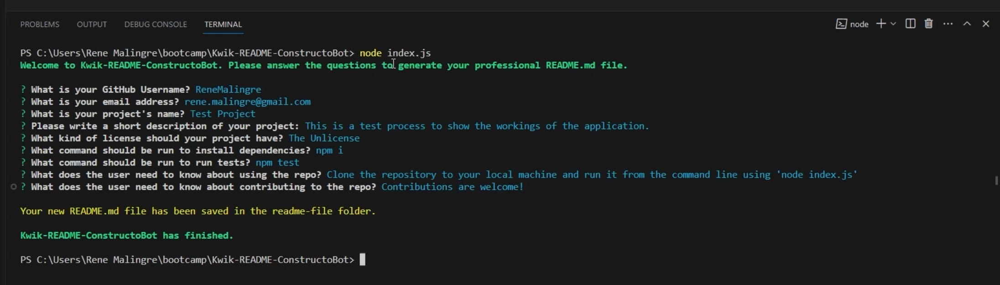

# Kwik-README-ConstructoBot

 [](https://opensource.org/licenses/MIT)

## Description

This is a command-line application that dynamically generates a professional README.md file from a user's input in order to make a user's project README.md file quicker to generate, and to be in a format that conforms to professional README style standards.

## Table of Contents

- [Technologies Used](#technologies-used)
- [Example](#example)
- [Installation](#installation)
- [Usage](#usage)
- [Screenshot](#screenshot)
- [Usage Video](#usage-video)
- [License](#license)
- [Contributing](#contributing)
- [Questions](#questions)

## Example

Example of a README.md file generated by the application:
[Example README.md](./docs/example/README.md)

## Technologies Used

- JavaScript
- Node.js
- Inquirer npm package
  
## Installation
  
Fork or copy the repository to your own machine. To install the necessary dependencies, run the following command in the terminal:
  
```bash
npm i
```
  
## Usage

 Open the terminal and navigate to the directory where you copied the repository.  Run the following command:

```bash
node index.js
```

Follow the prompts in the terminal to enter the information for your project.  The application will generate a README.md file in the './readme-file' directory.  Copy the README.md file to your project directory and edit it as needed.

## Screenshot

Screenshot of the application in use:



## Usage Video

Video of the application in use:

- Link to the video on Google Drive: [Online Video](https://drive.google.com/file/d/1NYqNV6uGDc8Tx79AS92WonD8KjMV8C4Q/view?usp=sharing)

- Link to the video on this repository: [GitHub Video](./docs/video/application-demo.mp4)

## License
  
This repository is licensed under the [MIT](https://opensource.org/licenses/MIT) license.
  
## Contributing
  
Contributions to this project will not be accepted, as this project is an assessment piece for a coding course, and it must be the project author's own work. However, feel free to fork the repository and make your own changes.
  
## Questions
  
If you have any questions about the repository, open an issue or contact me directly at:
[rene.malingre@gmail.com](mailto:rene.malingre@gmail.com).
  
You can find more of my work at [GitHub](https://github.com/ReneMalingre).

## Credits

Starter Code forked from [coding-boot-camp/potential-enigma](https://github.com/coding-boot-camp/potential-enigma) repository.

Professional README Guide: [coding-boot-camp.github.io/full-stack](https://coding-boot-camp.github.io/full-stack/github/professional-readme-guide)

Command line questions magic: [Inquirer npm package](https://www.npmjs.com/package/inquirer)

JavaScript runtime: [Node.js](https://nodejs.org/en/)

License badges from:
[Lukas Himsel](https://gist.github.com/lukas-h/2a5d00690736b4c3a7ba) via [shields.io](https://shields.io/)
